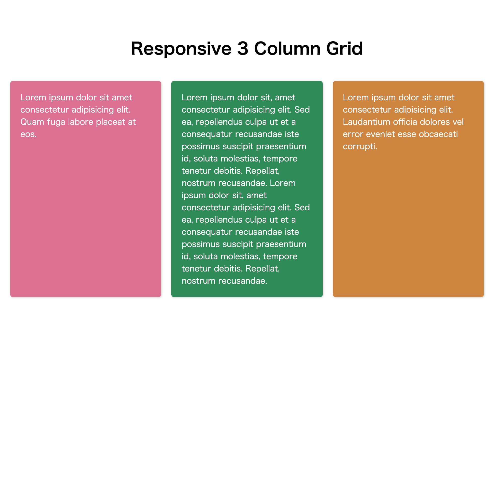
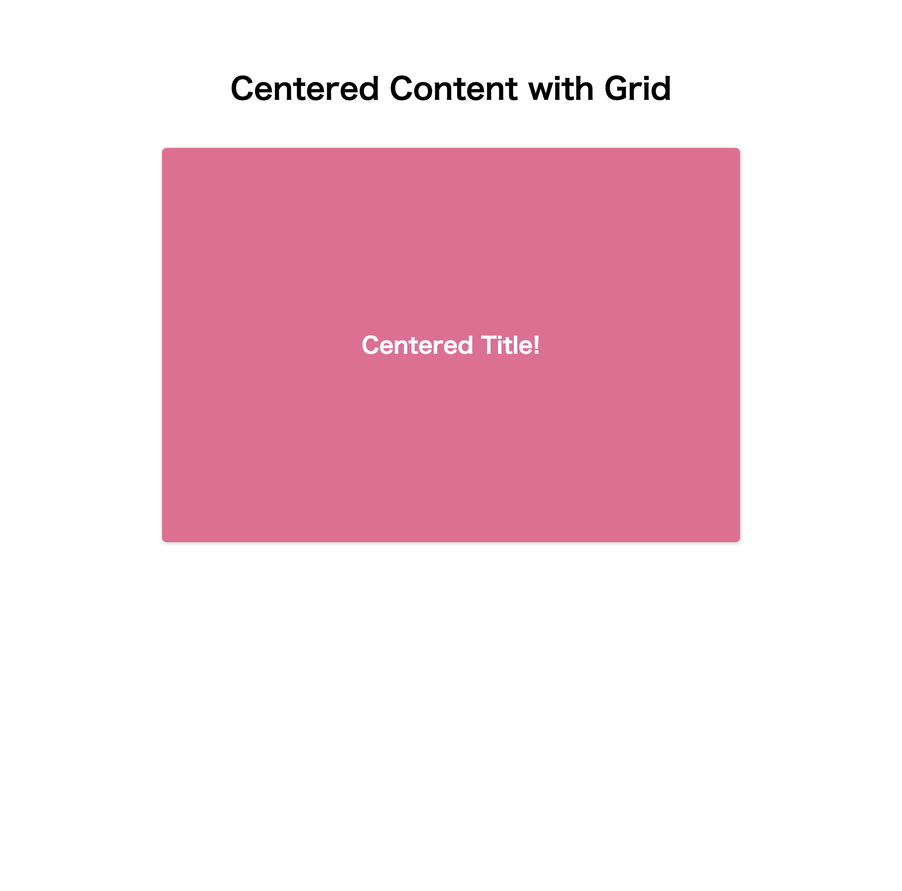
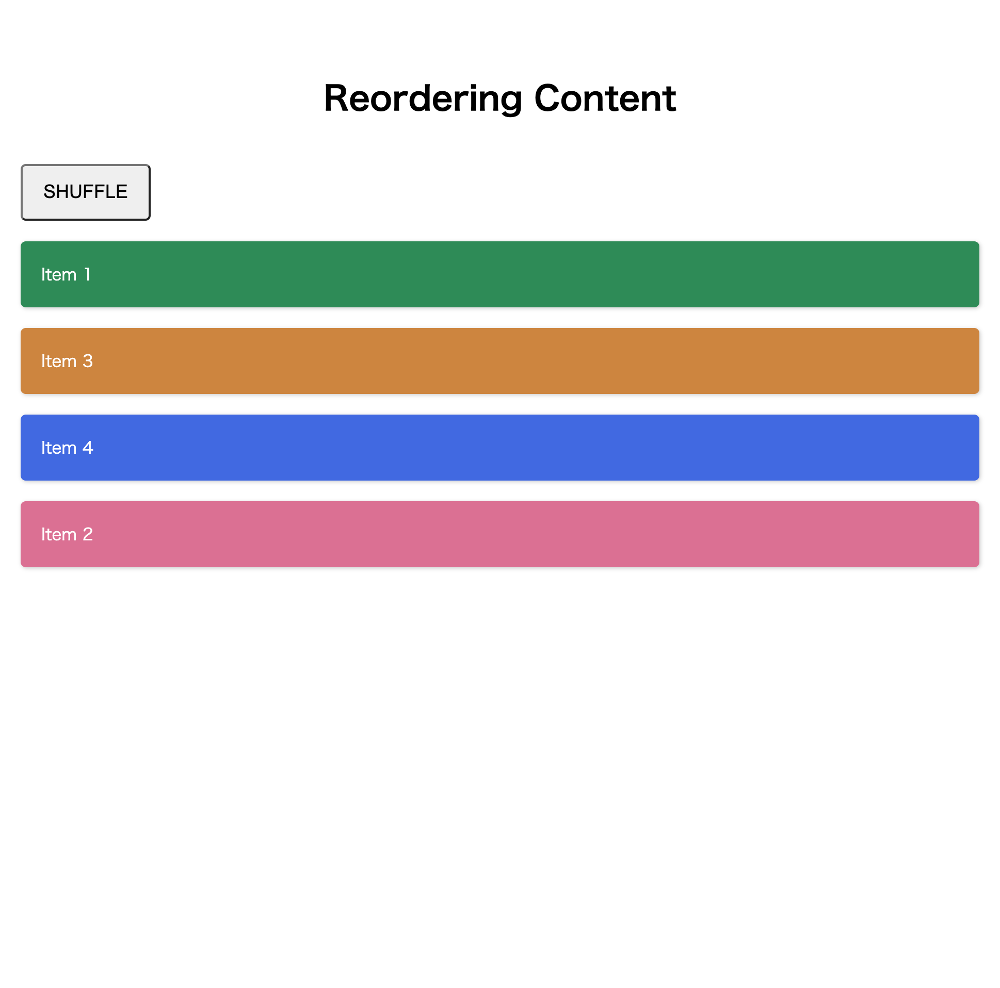
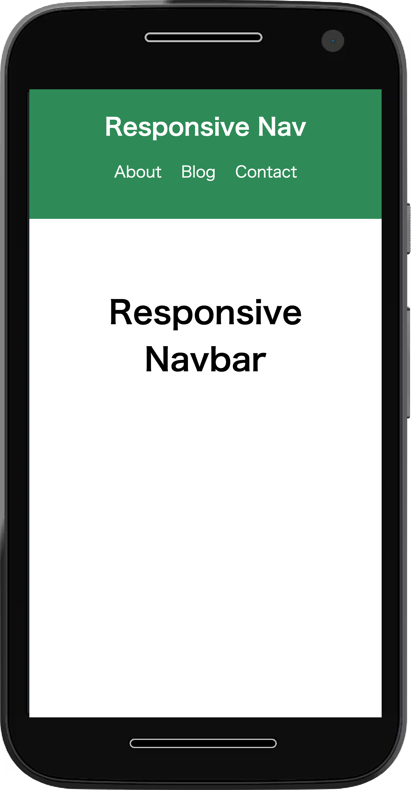
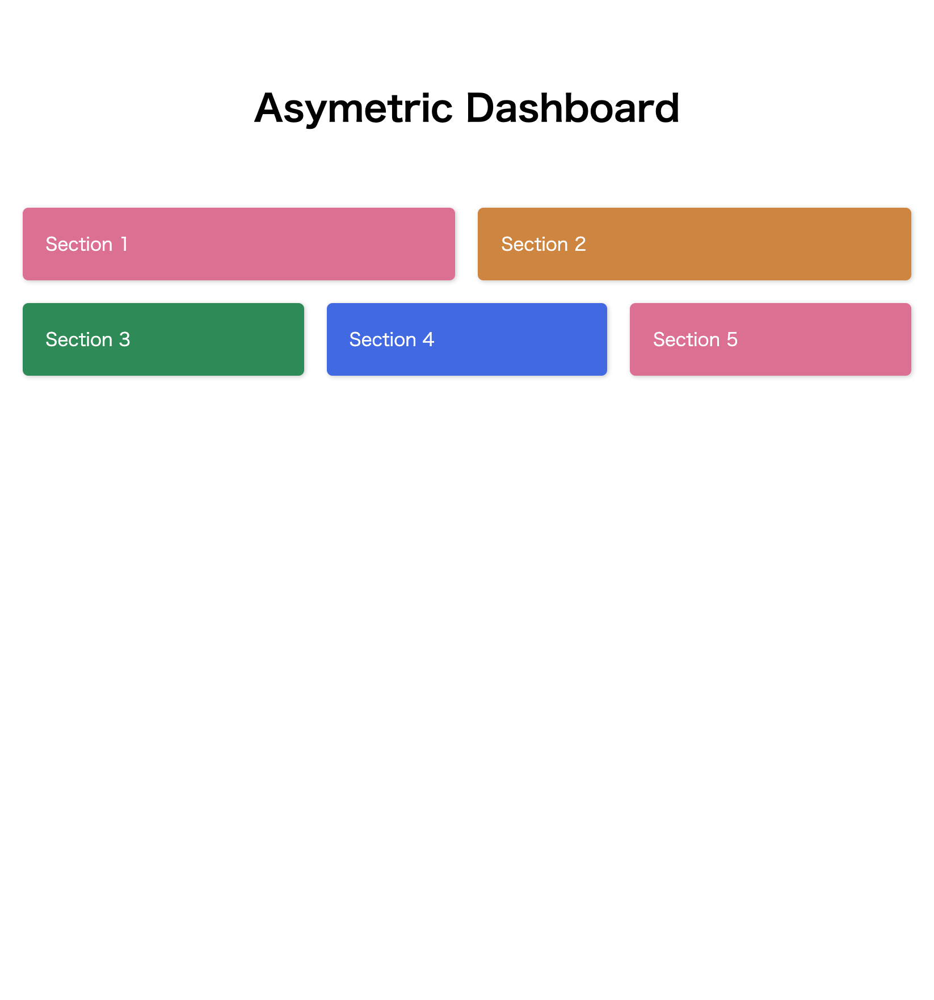
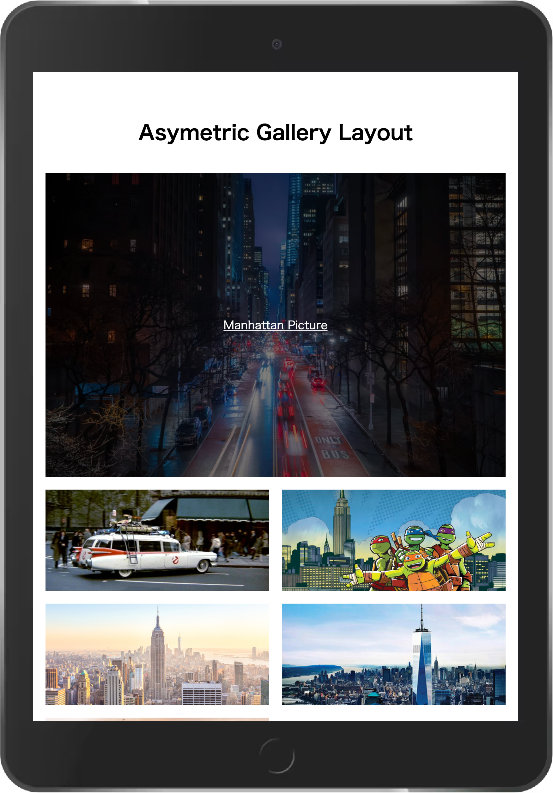
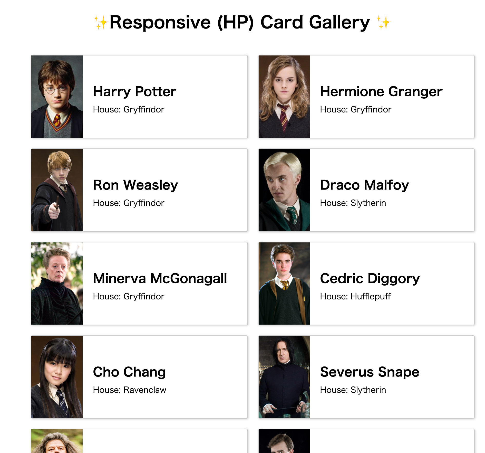
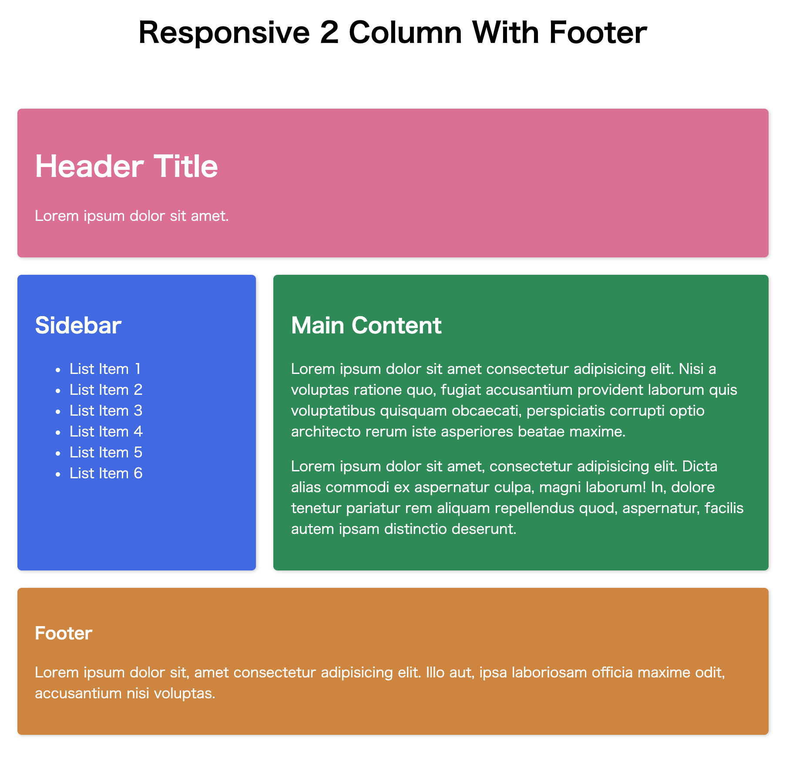
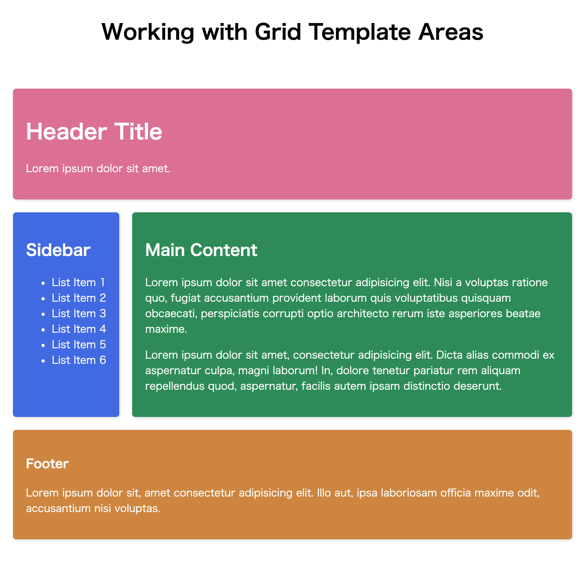
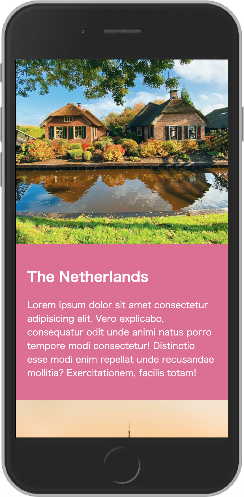

# Grid-Layouts

<h4>CreatedAt:3th Dec 2021</h4> 

## ScreenShot of the project

## Layout1

## Layout2

## Layout3

## Layout4

## Layout5

## Layout6

## Layout7

## Layout8

## Layout9

## Layout10

## Detail of the project

10 Examples of CSS Grid Course in Youtube

https://www.youtube.com/watch?v=wfXz8rW_fUs

## Purpose of the project

Create Web Layout with Grid CSS

## Demo

https://hiros-dev.github.io/Grid-Layouts/

## What did I learn from this project?

How to design Simple Web Layout

How to design Responsive Layout with CSS Grid

Thank you for reading. And, happy coding!!!
